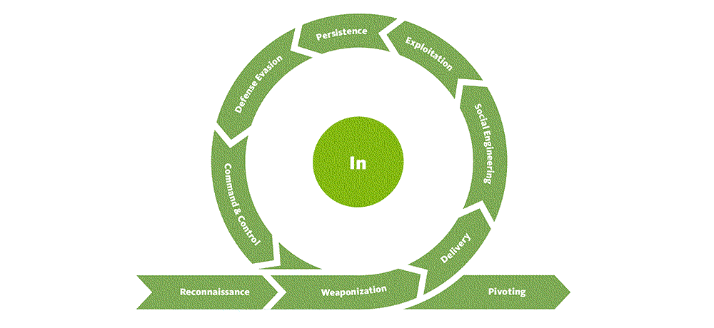
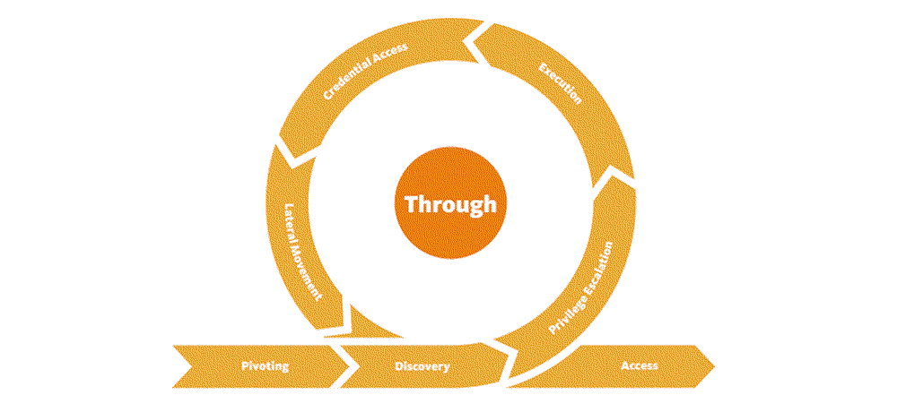
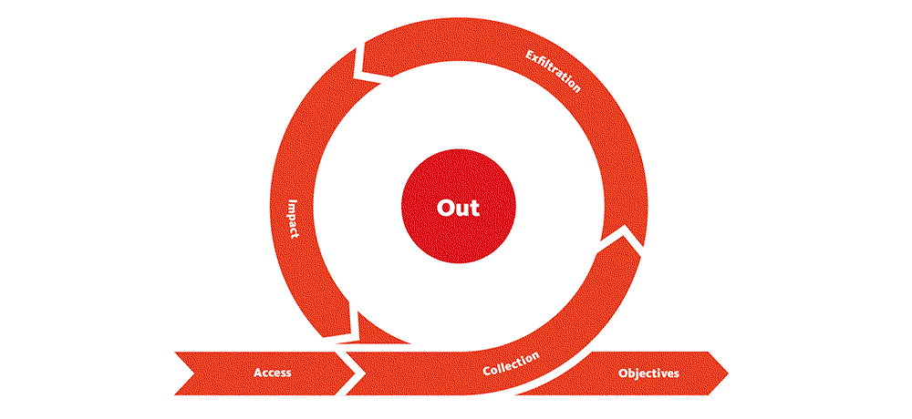

Red Team
=======================================

The red team simulates the TTP's of a most likely adversary and tries to get at the crown jewels
(usually a flag).

These are writeups made from our adventures in the forest, huge and wild, a digital landscape formed by nature's own
processes and humanoid activities and neglect throughout decades.

----

.. toctree::
   :caption: In

   Falconry (information gathering, initial port scanning) <https://tymyrddin.github.io/red-recon/>
   Lay of the land (enumeration, identifying vulnerabilities) <https://tymyrddin.github.io/red-enum/>
   A foothold in the cloud (weaponisation, attack infrastructure as code) <https://tymyrddin.github.io/red-iac/>
   A pocketful of acorns (physical attacks) <https://tymyrddin.github.io/red-acorns/>
   A canopy of apple-blossom (web application hacking) <https://tymyrddin.github.io/red-app/>
   API mayhem (hacking API's) <https://tymyrddin.github.io/red-api/>
   Head in the clouds (hacking cloud applications) <https://tymyrddin.github.io/red-cloud/>
   Riches in the ground (network attacks) <https://tymyrddin.github.io/red-network/>
   Evasion techniques (host, network) <https://tymyrddin.github.io/red-evasion/>

----

.. toctree::
   :caption: Through

   Monkeys know which trees to climb (exploitation and escalation) <https://tymyrddin.github.io/red-escalation/>
   Forest fire (red teaming) <https://tymyrddin.github.io/red-hurdles/>
   Mythical blue lake (AD hacks) <https://tymyrddin.github.io/red-ad/>

----

.. toctree::
   :caption: Out

   Beyond the visible (crypt) <https://tymyrddin.github.io/red-crypt/>

----

.. toctree::
   :caption: Links

   Laws of the forest <https://tymyrddin.github.io/>
   Blue Team <https://tymyrddin.github.io/blue/>
   Green Team <https://tymyrddin.github.io/green/>