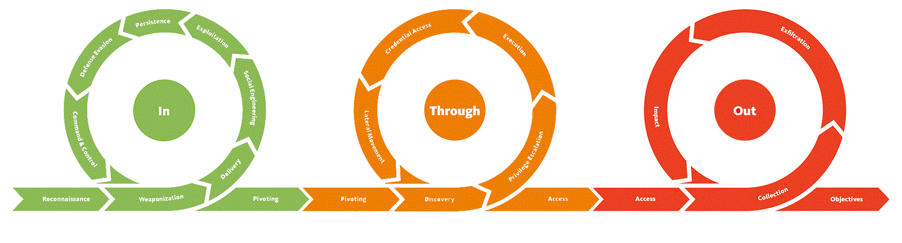

Red Team
=======================================

The red team simulates the TTP's of a most likely adversary and tries to get at the crown jewels
(usually a flag).

These are writeups made from our adventures in the forest, huge and wild, a digital landscape formed by nature's own
processes and humanoid activities and neglect throughout decades.

----

.. toctree::
   :caption: In

   Falconry (information gathering, initial port scanning) <https://red.tymyrddin.dev/projects/recon/>
   Lay of the land (remote enumeration, identifying vulnerabilities) <https://red.tymyrddin.dev/projects/enum/>
   A foothold in the cloud (weaponisation, attack infrastructure as code) <https://red.tymyrddin.dev/projects/iac/>
   A pocketful of acorns (physical attacks) <https://red.tymyrddin.dev/projects/acorns/>
   A canopy of apple-blossom (web application hacking) <https://red.tymyrddin.dev/projects/app/>
   API mayhem (hacking API's) <https://red.tymyrddin.dev/projects/api/>
   Head in the clouds (hacking cloud applications) <https://red.tymyrddin.dev/projects/cloud/>
   Riches in the ground (network attacks) <https://red.tymyrddin.dev/projects/network/>
   Evasion techniques (host, network) <https://red.tymyrddin.dev/projects/evasion/>

----

.. toctree::
   :caption: Through

   The grove (for a simplified impression) <https://red.tymyrddin.dev/projects/basic/>
   Monkeys know which trees to climb (exploitation and escalation) <https://red.tymyrddin.dev/projects/escalation/>
   Forest fire (a red teaming trail) <https://red.tymyrddin.dev/projects/fire/>
   Mythical blue lake (Active Directory hacks) <https://red.tymyrddin.dev/projects/ad/>

----

.. toctree::
   :caption: Out

   Beyond the visible (crypt) <https://red.tymyrddin.dev/projects/crypto/>
   Data exfiltration <https://red.tymyrddin.dev/projects/exfil/>

----

.. toctree::
   :caption: Links

   Curated collections of sessions on youtube <https://www.youtube.com/@ninabarzh/playlists>
   Laws of the forest <https://purple.tymyrddin.dev/>
   Blue Team <https://blue.tymyrddin.dev//>
   Green Team <https://green.tymyrddin.dev/>
